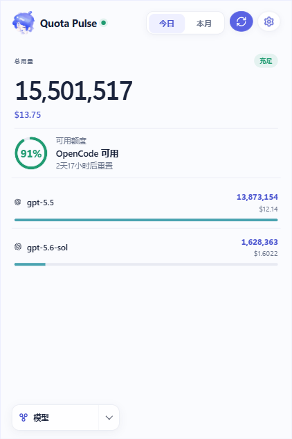
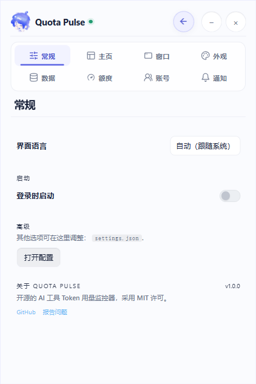

<p align="right">
   <a href="./README.md">EN</a> | <strong>简</strong> | <a href="./README.zh-TW.md">繁</a> | <a href="./README.ko.md">KO</a> | <a href="./README.ja.md">JA</a>
</p>
<div align="center">
    
    <h1>Quota Pulse</h1>
</div>

<p align="center">
    <em>跨设备聚合每个 AI 编程工具的实时用量。</em>
</p>

<p align="center">
    <a href="https://github.com/2310770803/quota-pulse/releases"></a>
    <a href="https://github.com/2310770803/quota-pulse/releases"></a>
    
    
    
    <a href="https://discord.gg/HmdNVVvw5P"></a>
    <a href="LICENSE"></a>
</p>

<table>
<tr>
<td width="435" align="center"><br><sub>实时 Token 总量、成本、额度与模型明细</sub></td>
<td width="435" align="center"><br><sub>紧凑的设置工作区，版本号为 1.0.0</sub></td>
</tr>
</table>

## Quota Pulse 是什么？

一款桌面小部件，实时显示 Claude Code、Codex、Cursor、GitHub Copilot 等 28+ 种 AI 编程工具的 Token 用量与 AI 工具额度，具备实时多设备同步与历史使用趋势功能，并支持按工具、设备、模型、session 或项目分项显示。

Quota Pulse 在早期产品与架构探索中参考了 [Token Monitor](https://github.com/Javis603/token-monitor)。此后项目已形成独立的品牌、设置信息架构、界面与工作区导航。

## 支持的工具

Quota Pulse 对 Token 用量、账户额度和 session 明细分别支持：

| Logo | 工具 | 数据路径 | Token 用量 | AI 工具额度 | session 明细 |
|:---:|------|-----------|:---:|:---:|:---:|
|  | Claude Code | `~/.claude/projects/`、`~/.claude/transcripts/` | ✅ | ✅ | ✅ |
|  | Codex | `~/.codex/sessions/` | ✅ | ✅ | ✅ |
|  | OpenCode | `~/.local/share/opencode/` | ✅ | ✅ | ✅ |
|  | Hermes Agent | `$HERMES_HOME/state.db` 或 `~/.hermes/state.db` | ✅ | — | — |
|  | OpenClaw | `~/.openclaw/agents/` | ✅ | — | — |
|  | Cursor | `~/.config/tokscale/cursor-cache/`（由 Cursor 同步保持更新） | ✅ | ✅ | — |
|  | Antigravity | `~/.config/tokscale/antigravity-cache/`（由 Antigravity 同步保持更新） | ✅ | ✅ | — |
|  | Cline | VS Code globalStorage tasks（`.../saoudrizwan.claude-dev/tasks/`） | ✅ | — | — |
|  | Kimi CLI / Kimi Code | `~/.kimi/sessions/`、`~/.kimi-code/sessions/`（`KIMI_CODE_HOME`）；Kimi Code API 密钥（通过 Kimi API 查询 Kimi Code 额度） | ✅ | ✅ | — |
|  | Qwen CLI | `~/.qwen/projects/` | ✅ | — | — |
|  | Grok Build | `$GROK_HOME/sessions/` 或 `~/.grok/sessions/` | ✅ | ✅ | — |
|  | GitHub Copilot | VS Code `workspaceStorage/*/chatSessions/`、`~/.copilot/otel/` | ✅ | ✅ | — |
|  | Pi | `~/.pi/agent/sessions/`、`~/.omp/agent/sessions/`（Oh My Pi） | ✅ | — | — |
|  | Zed | `~/.local/share/zed/threads/threads.db` | ✅ | — | — |
|  | Kilo Code | VS Code globalStorage tasks（`.../kilocode.kilo-code/tasks/`）—— 仅 Linux 与远程/WSL | ✅ | — | — |
|  | MiMo Code | `~/.local/share/mimocode/mimocode.db` | ✅ | ✅ | — |
|  | ZCode / GLM | `~/.zcode/projects/`；Z.ai API 密钥（通过 Z.ai API 查询 GLM 个人/团队 Coding Plan 额度） | ✅ | ✅ | — |
|  | Kiro | `~/.kiro/sessions/cli/`、Kiro IDE globalStorage 与 `kiro-cli` 数据库 | ✅ | ✅ | — |
|  | CodeBuddy | `~/.codebuddy/projects/` 与 IDE / VS Code 扩展日志 | ✅ | — | — |
|  | WorkBuddy | `~/.workbuddy/projects/`、`~/.workbuddy/workbuddy.db` | ✅ | — | — |
|  | Proma | `~/.proma/agent-sessions/*.jsonl` | ✅ | — | — |
|  | DeepSeek | DeepSeek API 密钥（通过 DeepSeek API 查询余额） | — | ✅ | — |
|  | OpenRouter | OpenRouter API 密钥（查询用量／密钥上限；获授权访问 credits 时显示余额，官方文档指定 Management 密钥） | — | ✅ | — |
|  | Minimax | Minimax API 密钥（通过 Minimax API 查询 Token Plan 额度） | — | ✅ | — |
|  | Volcengine | Ark API key 或火山引擎 AK/SK（通过火山引擎 API 查询火山方舟 Coding Plan 额度） | — | ✅ | — |
|  | Qoder | Qoder dashboard cookie（通过 Qoder usage API 查询 big-model credits） | — | ✅ | — |
|  | Ollama | Ollama Cloud cookie（通过 ollama.com/settings 查询 session／每周用量） | — | ✅ | — |
|  | 第三方 API | New API 兼容账号预设方案（包括兼容的 One API 分支）、New API 密钥预设方案与声明式自定义余额端点 | — | ✅ | — |

Custom 会从一个 GET 余额端点映射数值 JSON 字段；仅兼容 OpenAI 或 Anthropic API 并不足够。

## 为什么用 Quota Pulse？

Quota Pulse 是一个紧凑的桌面工作区，用于查看本地 AI 编程工具用量、账户额度和 session 明细。

## 功能特性

### 用量追踪

- **实时 Token 追踪**：Claude Code、Codex、Cursor、GitHub Copilot、Antigravity、OpenCode 等 21+ 种 AI 工具，每轮对话后 UI 在数秒内刷新（完整列表见上方表格）
- **单个 session 明细**：点进 Claude Code、Codex 或 OpenCode 的 session，可看每条提问的 Token 消耗，并展开查看每次回复的 Token 拆分与用到的工具（打开时才实时读取本机 transcript 或数据库，绝不同步）
- **缓存命中统计**：点击任何工具或模型，展开查看输入 Token（缓存命中与未命中）、输出 Token 的详细分类及命中率百分比
- **成本与币别**：Token 数量旁附带成本；可用 USD、TWD、HKD 或 CNY 显示，汇率每日自动更新，也可在设置中手动覆写
- **WSL 用量（Windows）**：运行中 WSL 发行版里的文件型用量会自动识别，约每 5 分钟并入总量；OpenCode、Hermes 等 SQLite 来源可能需要按照[指南](docs/wsl-sqlite-setup.zh-CN.md)在 WSL 内运行 headless agent

### 额度、趋势与导出

- **AI 工具额度检测**：涵盖 Claude Code、Codex、Cursor、OpenRouter、第三方 API、GLM、Kimi 等 18+ 家提供方的 session、每周、账单与 credits 窗口，支持多个 OpenRouter／第三方 profile，以及 DeepSeek 预付余额与消费
- **多账号与 Codex 账号切换**：同一提供方可追踪多个账号、各自显示额度；已加入追踪的 Codex 账号还能一键切换为本机使用账号，免重新登录授权
- **保留已删除会话用量**：许多工具会定期清除旧 session（Claude Code 默认清 30 天前的 transcript），一删就再也算不到。开启后，Quota Pulse 会在本地不设期限地归档已观测到的每日工具／模型用量，让热力图与趋势即使在来源文件被清掉后仍然完整（详见下方[〈会话数据保留期〉](#会话数据保留期)）
- **使用趋势与仪表板**：主页的活跃热力图与趋势图，加上独立的仪表板窗口，提供连续天数，以及跨所有设备、按工具／按模型堆叠的历史（柱状图与 K 线两种视图）
- **可选的状态视图**：追踪 Claude、OpenAI、Cursor 与 DeepSeek status 页，支持手动或定时重新检查
- **数据导出**：把使用数据导出成与工具无关的 CSV + JSON，可手动或自动写入文件夹，接电子表格、Obsidian、Grafana 或自写脚本；详见 [docs/export.md](docs/export.md)

### 多设备与部署

- **多设备实时同步**：通过 Server-Sent Events 推送，一台设备的更新数秒内出现在其他设备
- **本地优先**：单设备使用完全无需服务器
- **自托管同步后端**：小部件内 hub、Node CLI hub 或 Cloudflare Worker
- **iOS 小部件支持**：通过 Worker hub 搭配 Widgy、Scriptable
- **隐私优先**：提示词、回复、源代码和文件内容都留在你的设备上

### 界面与呈现

- **分组视图**：可按工具、设备、模型、session、项目或账户额度分组查看用量
- **菜单栏（macOS）与系统托盘（Windows）弹出窗口**：图标旁可显示成本、token 数，或最接近用完的提供方剩余额度百分比
- **悬浮小窗模式**：可将组件收成可拖动的紧凑小窗，支持点击或悬停预览展开，并可显示托盘同款内容
- **菜单栏排版自定义**：菜单栏与悬浮小窗的显示内容可以直接挑内置版式，也可以选“自定义…”自己排——加入 AI 工具图标、额度条、百分比、重置时间、成本或自定义文字等项目，拖动排序并实时预览，每个项目还能各自指定 AI 工具、账号、额度周期与字体
- **外观控制**：界面主题切换（含浅色模式）、各工具厂商色、玻璃透明度、模糊度、完全透明窗口
- **工具列表自定义**：可隐藏、置顶和拖曳排序主列表中的工具，不影响实际追踪
- **可录制全局快捷键**：可从任何地方快速显示或隐藏窗口
- **Discord Rich Presence**：将今日 Token、花费与主要工具广播到你的 Discord 个人资料（需手动开启）

## 安装

从 [GitHub Releases](https://github.com/2310770803/quota-pulse/releases) 下载。

- **macOS（Apple Silicon）** — `.dmg`，已签名并 notarize
- **macOS（Intel）** — x64 `.dmg`，已签名并 notarize
- **Windows 10/11** — 安装版和便携版 `.exe`，均[已签名](docs/code-signing.md)
- **Linux x64** — `.AppImage`

打包版会自动检查 GitHub Releases。有新版本时，界面会显示更新提示；受支持的平台也可在 设置 → 常规 中安装更新。

### 首次启动

本地模式是默认模式：启动 App 后会开始追踪这台设备。无需 hub、代理或配置。

## 多设备同步

挑一个所有设备（与任何无头代理）都能连上的 hub 后端。在每台设备上打开小部件，在 设置 → 多设备同步 选一个模式。小部件会自动上报本机用量；只在没有小部件的机器上跑 `npm run agent`。

#### 方案 A——直接在小部件内开 hub（最简单，无需命令行）

在一台长期开机的机器上打开小部件，进入 设置 → 多设备同步，选 **在这台设备托管 Hub**。小部件会生成随机 secret，并列出其他设备可以连入的局域网 URL（Tailscale 或 ZeroTier 地址也会显示在这里）。在其他每台设备上选 **连接到 Hub**，把 URL 与 secret 贴进去即可。

只要 Quota Pulse 还在运行，后台监控就会继续——退出 App（仅关闭窗口不算）会停止后台监控。

#### 方案 B——自托管 Node hub（长期开机的无头机器）

```bash
# 在长期开机的机器上
cp .env.example .env
# 把 QUOTA_PULSE_SECRET 设为你私有的值，然后:
npm run hub
```

#### 方案 C——Cloudflare Worker hub（跨网络，包含 iPhone）

[](https://deploy.workers.cloudflare.com/?url=https://github.com/2310770803/quota-pulse/tree/main/worker)

一键部署——Cloudflare 会在过程中提示你输入 `QUOTA_PULSE_SECRET`。或手动部署:

```bash
cd worker
npm install
npx wrangler login
npx wrangler secret put QUOTA_PULSE_SECRET
npx wrangler deploy
```

把部署 URL 贴到每台设备的小部件 设置 → 多设备同步。iOS 小部件配方与端点参考见 [worker/README.md](worker/README.md)，hub HTTP API 见 [docs/API.md](docs/API.md)。

## App 数据

App 状态保存在系统的用户数据目录——卸载时一并删除该目录即可完整移除。

| 平台 | 路径 |
|------|------|
| macOS | `~/Library/Application Support/AIQuotaPulse/` |
| Windows | `%APPDATA%/AIQuotaPulse/` |
| Linux | `~/.config/AIQuotaPulse/` |

## 从源码构建

如需自己从源码打包安装包，请在**对应的**操作系统上使用 Node.js 22.13+（electron-builder 无法在 Windows 上交叉构建 macOS 的 `.dmg`，反之亦然）。

```bash
npm install
npm run dist:mac     # macOS arm64 .dmg → dist/
npm run dist:mac:x64 # macOS Intel x64 .dmg → dist/
npm run dist:win     # Windows x64 安装包 .exe → dist/
npm run dist:linux   # Linux x64 AppImage → dist/
npm run pack         # 未打包的 app 目录（无安装包），方便本机快速测试
```

产物会放在 `dist/`。Windows 和 Linux 请在对应系统上使用上面的 `dist:*` 脚本。如果要打包 macOS 发布版，需要本机有 Developer ID Application 签名身份；本地开发或未列出的平台请用 `npm start` 运行。

## 工作原理

```text
模式 A——本地（默认，免配置）
    小部件 (Electron) ──▶ tokscale ──▶ ~/.claude、~/.codex、$HERMES_HOME

模式 B——同步（可选，多设备）
    设备 A agent ──▶
    设备 B agent ──▶  hub  ──▶  任一设备上的小部件
    设备 C agent ──▶
```

小部件会根据 设置 → 多设备同步 决定走本地还是同步模式。hub 本身可以是单独的 `npm run hub` 进程、Cloudflare Worker，或直接跑在某一个小部件里（Host 模式）。同步模式下，hub 通过 Server-Sent Events 把聚合后的统计推送给每个连接中的小部件，所以一台设备上的更新会在数秒内出现在其他设备上。

## 会话数据保留期

开启**保留已删除会话用量**（设置 → 采集）后，Quota Pulse 会在本地不设期限地归档已观测到的每日工具／模型用量——即使来源工具日后清掉 session，热力图与趋势也不受影响。

<details>
<summary><strong>进阶：延长来源工具本身的保留期</strong></summary>

<br>

热力图与同步数据采用 370 天的滚动窗口（更早的观测数据仍保留在本地供日后查看）。**Claude Code 默认只保留 30 天的 transcript**（`cleanupPeriodDays`）；若想在归档启用前就保住完整的滚动年份，请在时限过去之前于 `~/.claude/settings.json` 调高：

```json
{
  "cleanupPeriodDays": 370
}
```

设更大能留更多，代价是 transcript 会按你设定的期限一直留在磁盘上。其他工具的默认值与配置文件路径，请见 tokscale 的 [Session Data Retention](https://github.com/junhoyeo/tokscale#session-data-retention) 表。

这份归档只涵盖 Quota Pulse 已观测过的日期；在它开始追踪之前就被删除的数据无法找回。

</details>

## 设置

设置分两处，日常使用只需要前者：

- **小部件（GUI）**——点右上角的 `⚙` 打开。设置采用双栏控制中心：从左侧选择目的地，在右侧专注编辑一个分区。左下角的工作区启动器用于切换主页、额度、会话、工具和模型视图。标题栏的 `⇧` 按钮可循环切换窗口行为。
- **无头代理与 hub**——没有 UI，用项目根目录的 `.env` 配置（从 `.env.example` 复制）；优先级为 CLI 参数 → 环境变量 → 内置默认。

每一项设置与所有环境变量的完整说明，请见[设置参考文档](docs/configuration.md)。

## 隐私

Quota Pulse 在本地处理使用日志，不会向项目维护者发送分析或遥测数据。网络访问仅用于文档所述或由用户启用的功能；更新、提供方集成、Discord Rich Presence 与可选多设备同步所使用的数据，请参阅[隐私政策](docs/privacy.md)。

## 参与贡献

欢迎提交 Issue 和 PR。项目规范、架构说明和命令参考都在 [AGENTS.md](AGENTS.md) 中——它是为编码代理编写的，但同样可以作为贡献者指南。

## 致谢

- [Token Monitor](https://github.com/Javis603/token-monitor) 是本项目早期在产品范围与部分初始架构上的参考。Quota Pulse 现已建立独立的品牌、设置信息架构、主界面呈现与工作区导航。
- [tokscale](https://github.com/junhoyeo/tokscale) 提供日志解析与 Token 计算。
- [CodexBar](https://github.com/steipete/CodexBar) 提供 AI 工具额度的研究参考。
- **[代码签名政策](docs/code-signing.md)：** 免费代码签名由 [SignPath.io](https://signpath.io/) 提供，证书由 [SignPath Foundation](https://signpath.org/) 提供。

## 许可证

[MIT](LICENSE) © [@Javis](https://github.com/Javis603)
